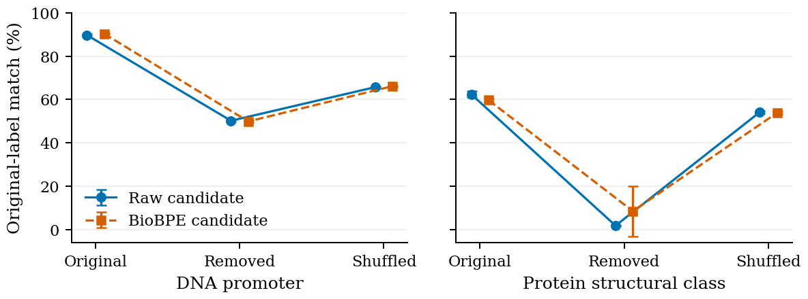
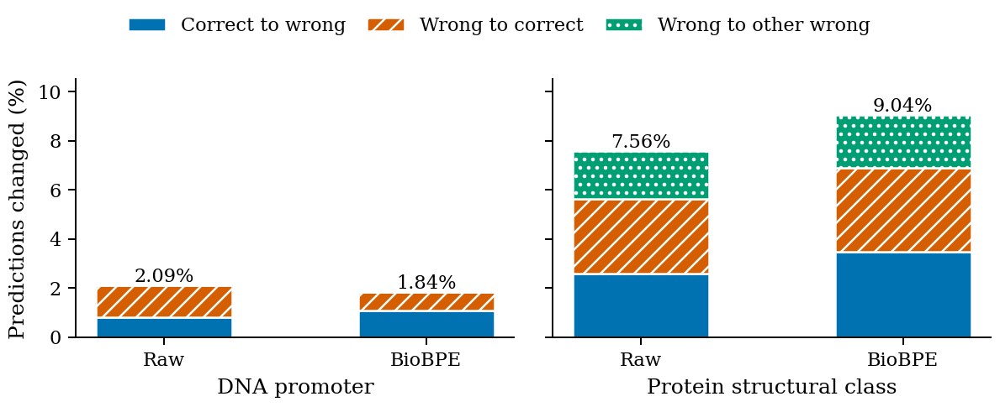

# Laya-Bio：短生物序列上的候选评分与可靠性评估

**Liang Wang1, ∗** 
1School of Artificial Intelligence and Automation, 
Huazhong University of Science and Technology, 430070, P.R. China

**结果版工作稿，2026-09-23。** 本稿依据四条件、各三个 seed 的完整实验及固定 test 结果更新；英文 [PDF](../paper/main.pdf) 和 [LaTeX](../paper/main.tex) 含完整附录。旧实验前稿保存在[历史快照](archive/laya_bio_paper_draft.pre-results.md)。当前稿尚未经过外部模型或同行评审，未绑定投稿会议。

## 摘要

本文评估开放候选评分编码器在短生物序列上的监督适配，不追加神经网络持续预训练（CPT），并区分预测质量、分词压缩和候选顺序可靠性。从同一 Laya checkpoint 出发，我们在 DNA 启动子检测与七类蛋白结构分类上训练原始输入候选模型、完整生物 BPE 候选模型、固定类别读出及无序列对照。四条件各使用三个 seed 和相同监督预算，在 test 前固定最后 checkpoint、输入及校准温度。完整 BPE 候选模型的 DNA/蛋白 test Accuracy 为 90.16%/59.05%，比本版固定类别头高 1.40/7.91 个百分点；原始输入候选模型在两个任务上都更准确。BPE 缩短输入，但未减少实测训练时间。开发集干预支持序列依赖，同时揭示位置敏感性：蛋白候选重排改变 9.04% 的完整 BPE 预测，整体准确率却只小幅变化。这些结果支持受限任务上的候选接口适配，但不支持分词普遍增益、候选顺序不变性或未见任务泛化。

## 1. 引言

候选评分接口接收序列、任务描述和有限的文本标签集合，直接输出标签概率，使多个分类任务能通过一个模型调用，无需生成自由文本答案。把这种接口适配到生物序列，需要检验预测是否依赖序列、是否随候选位置改变，以及分词压缩是否转化为实际收益。

本文使用开放的 [Laya](https://github.com/NandhaKishorM/laya) typed-decision 编码器，研究 DNA 启动子二分类和蛋白粗粒度结构七分类。我们比较原始文本分词与历史生物 BPE，加入固定类别输出与训练过的无序列对照。BPE 是保留的输入功能，而不是预设有效的性能改进。本轮没有追加神经网络 CPT。

主要发现具有明确边界：完整 BPE 候选模型在三个 seed 上均优于当前固定头，但其 test Accuracy 低于 raw 候选模型。候选重排还能在几乎不改变总分时，改变相当数量的逐样本预测。因此，本文贡献是可核验的适配流程、同监督预算比较和可靠性诊断，不声称新的生物基础模型、未见任务理解或优于专用生物编码器。

## 2. 相关工作

自然语言与生物序列联合建模已有直接先例。[ProtST](https://proceedings.mlr.press/v202/xu23t.html)通过生物医学描述增强蛋白表示，包含监督与零样本预测；[BioTranslator](https://www.nature.com/articles/s41467-023-36476-2)将生物特征和文本描述映射到共享表示以支持零样本分类。本文只有两个固定候选集合，不能据候选文本出现在输入中便声称获得类似零样本能力。

[LLaMA-Gene](https://arxiv.org/abs/2412.00471)结合生物词表扩展、进一步预训练及指令微调，其指令语料也是本轮两个 BioPAWS-2 任务视图的来源。[ChatNT](https://www.nature.com/articles/s42256-025-01047-1)连接生物序列和会话式语言接口。本文研究编码器上的有限候选评分，没有复现这些生成式方法的训练，也不进行跨论文成绩排名。

[DNABERT-2](https://proceedings.iclr.cc/paper_files/paper/2024/hash/b633e7052970b8f5aa1a69164d99e9e8-Abstract-Conference.html)在基因组基础模型中使用 BPE；其收益不自动适用于小预算的文本模型监督扩表。[ModernBERT](https://aclanthology.org/2025.acl-long.127/)是本次 Laya checkpoint 的编码器基础，我们保持实际 checkpoint 的 1,024 token 配置，不从底座原生长度推断当前模型可使用更长输入。

概率校准沿用[温度缩放](https://proceedings.mlr.press/v70/guo17a.html)，在独立 calibration 集拟合每个 checkpoint、每个任务的标量温度。序列干预与候选重排用于不同诊断，都不能替代同源隔离和新任务描述评估。

## 3. 模型与适配

### 3.1 候选评分与监督目标

样本由任务上下文 $q$、序列 $s$、候选集合 $C=(c_1,\ldots,c_K)$ 和正确索引 $y$ 构成，$K$ 为 2 或 7。Laya 在候选前放置 marker；编码器、choice type embedding 和两个上下文 head block 产生 marker 隐状态 $h_j$，共享读出 MLP 得到 $z_j=g_\theta(h_j)$。目标为普通候选交叉熵：

$$
\mathcal L=-\frac1N\sum_i\log\frac{\exp z_{i,y_i}}{\sum_{j=1}^{K_i}\exp z_{i,j}}.
$$

编码器、embedding、上下文 head 与候选 scorer 均参与监督训练，未使用的 action head 冻结。训练候选顺序由 seed 与样本 ID 的哈希确定，在同一 run 内固定，不是每个 epoch 重新采样。标签随排列重映射，标准评价使用 canonical 顺序。这是 CE 适配，不是作者 RLCD 的复现或目标比较。

### 3.2 完整生物 BPE

raw 使用原 Laya tokenizer 编码完整文本。完整 BPE 用历史 DNA/protein BPE 单独切分序列，再直接映射到新增模型 ID；自然语言上下文和候选保持原 tokenizer。历史脚本记录约 1 GiB/模态的采样、seed 42 和最低词频 10，不能称为当前 benchmark 的 train-only 词表。

原词表缺少 DNA N、protein N/J，存在静默丢字符风险。我们在副本中补齐这些单字符，保留旧 ID 与 merge，逐条要求 source pieces 拼接及模型 ID 逆映射恢复原序列。排除 source padding/unknown 后，加入 19,999 个 DNA token 和 8,000 个 protein token，词表由 50,368 扩至 78,367。

新片段 $v$ 在原 tokenizer 下分解为 $b_1,\ldots,b_m$，初始化为

$$
E_{\mathrm{new}}(v)=\frac1m\sum_{r=1}^{m}E_{\mathrm{old}}(b_r).
$$

这里使用裸片段，不包括包装符。原 embedding 行在初始化时不变，随后与新行共同接受监督更新。训练序列实际出现 18,448 个新增 DNA token 和 7,972 个 protein token；未出现词条不能声称获得直接序列监督。

### 3.3 对照与校准

B1 使用同一初始编码器、完整 BPE、上下文 head、type embedding 和读出 MLP，去掉候选字符串，池化 CLS 后接新初始化的 2/7 类矩阵，通过已知任务选择输出头。B1 与完整 BPE 候选模型的可训练参数量约为 449.709M 和 449.701M，但输入、池化及输出初始化不同，比较不能单独归因于候选语义。

text-only 在训练和评价中都移除序列，保留候选架构与监督预算。canonical 评价时，每个任务的输入完全相同，应产生固定类别预测。它与“只在推理时删除序列”是不同对照。

每个 checkpoint、每个任务在 calibration 上拟合 $T\in[0.05,20]$，以 NLL 最小化为目标；test 使用既有温度计算 $p_j=\operatorname{softmax}(z/T)_j$。正温度不改变类别，因此校准不能提高 Accuracy。

## 4. 数据与实验流程

数据来自本地 [BioPAWS-2](https://huggingface.co/datasets/dnagpt/biopaws-2) JSONL，source 字段指向 LLaMA-Gene。DNA 输入为 300 bp；蛋白不超过 512 aa，预测的是七个宽泛结构类别，不是细粒度 fold 识别。输入由 user 消息构造，assistant 答案仅用于 target。每个任务各有一个固定上下文模板和候选集合；精确实验版本由本地文件哈希确定。

先按序列去重，排除 train/val 标签冲突；DNA 额外使用反向互补 canonical group 做划分检查。保留 train 后排除 val 重叠，再以固定 seed 按 group、按类别将 val 约各半分为 dev 和 calibration。test 在前述成员固定后去重和排除 group 重叠，test 标签不参与过滤或划分。最终 exact/group 跨 split 重叠为零，但不代表同源独立。

| 任务 | Train | Dev | Calibration | Test |
|---|---:|---:|---:|---:|
| DNA promoter | 16,766 | 1,052 | 1,053 | 2,145 |
| 蛋白结构类别 | 15,284 | 926 | 933 | 1,952 |

共同完整输入名单继承自早期包装序列表示的长度审计，该审计从清洗后的蛋白 train/dev/calibration/test 分别排除 309/13/9/42 条，清洗后 DNA 全部保留。最终表示虽然更短，仍不补入这些记录，以维持同一集合。因此蛋白 test 覆盖清洗视图的 97.89%，本轮模型均无截断。

每条件从同一 Laya checkpoint 独立初始化，使用 seeds 20260922/20260923/20260924；混合两任务训练，不做任务重加权。训练为 3,005 更新、96,160 次样本处理，micro-batch 8、梯度累积 4、AdamW lr 2e-5、weight decay 0.01、5% warmup 后 cosine decay、BF16，设备为单卡 RTX 4080 SUPER。取最后 checkpoint，不早停；相同监督预算不等于相同计算量。

test 前固定全部 12 个 checkpoint、温度、输入和代码。每模型完整复现已保存 dev logits 后，以 batch 16 一次性评价 test。报告 Accuracy、固定类别 Macro-F1、Balanced Accuracy、MCC、NLL、multiclass Brier 和 ECE15。三 seed 的样本标准差表示训练波动，不是生物样本独立抽样的置信区间。本研究为迭代开发，不是公开平台的正式预注册。

## 5. 结果与诊断

### 5.1 Test 主结果

下表单位为 %，数值为三个 seed 的均值 ± 样本标准差。

| 模型 | DNA Accuracy | DNA Macro-F1 | 蛋白 Accuracy | 蛋白 Macro-F1 |
|---|---:|---:|---:|---:|
| raw candidate | 91.10 ± 0.35 | 91.09 ± 0.35 | 59.97 ± 0.56 | 50.63 ± 1.67 |
| 完整 BPE candidate | 90.16 ± 0.14 | 90.16 ± 0.14 | 59.05 ± 0.33 | 50.28 ± 0.42 |
| 完整 BPE B1 | 88.76 ± 0.37 | 88.76 ± 0.37 | 51.14 ± 5.36 | 38.00 ± 4.15 |
| text-only | 49.84 ± 0.57 | 33.26 ± 0.25 | 29.10 ± 0.00 | 6.44 ± 0.00 |

完整 BPE candidate 相对 B1 的 DNA/蛋白 Accuracy 配对差值为 +1.40±0.42/+7.91±5.69 个百分点，三个 seed 同向；蛋白 Macro-F1 高 12.28±4.56 个百分点。B1 蛋白 Accuracy 从 45.65% 到 56.35%，其波动不能被均值掩盖。

相对 raw，完整 BPE 的 DNA/蛋白 test Accuracy 低 0.93±0.29/0.92±0.49 个百分点，三个 seed 均同向。dev 上 DNA 的 +0.60 个百分点优势没有延续到 test。因此，BPE 输入功能得到实现，但预测收益未获支持。

### 5.2 概率质量与运行成本

| 模型 | DNA 原始→校准 NLL | 蛋白原始→校准 NLL |
|---|---:|---:|
| raw candidate | 0.243 → 0.222 | 1.190 → 1.044 |
| 完整 BPE candidate | 0.314 → 0.249 | 1.184 → 1.057 |
| 完整 BPE B1 | 0.300 → 0.279 | 1.241 → 1.236 |
| text-only | 0.693 → 0.693 | 1.630 → 1.628 |

温度均在此前 calibration 拟合。完整 BPE 的平均 NLL 改善，但 raw 校准后的 NLL 仍更低。ECE 与 NLL 不能互相替代：低准确率的常数预测器也可以有较低 ECE，不能按单个校准指标排序后声称模型更好。完整指标及标准差见英文表格和[机器可读结果](../artifacts/laya_locked_test/results.json)。

raw/完整 BPE 的训练输入中位数为 173/96 token，平均训练时间为 41.20/41.24 分钟，峰值 allocated 显存为 7.89/8.41 GiB。减少 token 没有减少本配置的训练墙钟时间；我们没有据此推断训练或推理加速，也未完成单独的推理延迟基准。

### 5.3 序列依赖：仅 dev 诊断

训练过的 text-only 在 test 上明显低于序列模型。对已训练完整 BPE 模型仅在推理时移除序列，DNA 原标签匹配率从 90.34% 降至 49.84%，蛋白从 59.65% 降至 8.42%；保留字符组成的重排后分别为 66.12% 和 53.79%。

每个训练 seed 先平均三个固定字符重排副本，再计算跨 seed 均值及标准差。干预后序列没有独立生物标签，数值仅是相对原标签的匹配率，不应称为其真实生物分类准确率。结果支持序列依赖，也提示组成相关信息，但不能识别具体生物机制。推理删除还是分布外变化，不等于训练过的 text-only。

### 5.4 候选顺序敏感性：仅 dev 诊断

对每条样本使用一个确定性非原始候选排列，将输出按语义映射回 canonical 类别后，完整 BPE 的 DNA/蛋白预测有 1.84%/9.04% 改变。蛋白中正确→错误为 3.49%，错误→正确为 3.38%，错误→其他错误为 2.16%；整体 Accuracy 仅变化 −0.11 个百分点。raw 蛋白也有 7.56% 的预测翻转。

正误转换会部分抵消，所以总体分数近似不变不能证明逐样本稳定。训练的固定候选排列增强并未产生顺序不变性。这里只覆盖每条样本一个非原始排列，不代表所有可能排列；test 没有另行筛选扰动方案。

## 6. 局限性

实验只有两个闭集任务、一个底座、三个 seed 和一版固定头；固定模板及候选集合不能证明未见任务、问题改写或新标签泛化。候选与 B1 的输入、池化及输出初始化差别也限制了“候选语义导致提升”的解释。没有与专用生物编码器或生成式模型进行匹配预算比较。

exact 与 DNA reverse-complement 清理不等于蛋白同源或 DNA 物种独立；历史聚类摘要缺少已核验的当前记录成员映射。历史 BPE 外部语料与 benchmark 的重叠、父 checkpoint 历史暴露均未排除。继承的完整输入过滤进一步限制覆盖，不能写成“无泄漏泛化”。

早期紧凑词表实验参与开发判断；最终方案在本轮 test 预测前固定，不意味着整个研究事先注册。三 seed 标准差不支持显著性结论。位置敏感性及不完全校准限制部署主张；本研究没有湿实验或临床验证。

## 7. 结论

在本次共同完整输入子集和固定监督预算下，完整 BPE Laya 候选模型优于实现的 B1 与 text-only；raw 候选模型却在两任务 test Accuracy 上更高。完整 BPE 缩短输入但没有提高实测训练速度。开发集诊断显示模型利用序列，同时对候选位置敏感。当前可交付的是受限适配基线、完整比较及可靠性流程，而不是普适分词收益或开放式生物理解能力。后续方法研究需要新的评价设计处理同源与模板泛化，不能重复用已查看的 test 挑选方案。

## 复现说明

test 前固定的 288 个文件在完成后核验一致；12 个模型完整 dev logits 重载误差为 0；每模型评价同一组 4,097 样本，无截断且 logits 有限。独立 sklearn/SciPy 指标复算最大绝对误差约 2.22e-16。权重、代码版本、全部 seed 指标、类别支持数、运行成本和诊断明细见英文附录。

数据、代码、模型权重和历史语料现已公开，可匿名访问。固定版本如下：

| 资源 | 发布范围 | 固定版本 |
|---|---|---|
| [dnagpt/laya-bio](https://huggingface.co/datasets/dnagpt/laya-bio) | 两任务原始快照、清洗及论文子集、划分清单、逐样本预测与 logits、训练评测和图表代码、BPE 资产及论文材料 | [`0307d5910b0a37f54caecd444241db6b56331701`](https://huggingface.co/datasets/dnagpt/laya-bio/tree/0307d5910b0a37f54caecd444241db6b56331701) |
| [dnagpt/laya-bio-models](https://huggingface.co/dnagpt/laya-bio-models) | 四种条件各三个 seed 的 12 份最终 checkpoint，另附原始初始化权重、分词器、配置及加载代码，共 22.46 GB | [`6d727dd4125d783ab719a35c6b55dd7a69276a8d`](https://huggingface.co/dnagpt/laya-bio-models/tree/6d727dd4125d783ab719a35c6b55dd7a69276a8d) |
| [dnagpt/laya-bio-historical-corpora](https://huggingface.co/datasets/dnagpt/laya-bio-historical-corpora) | 七份历史原始语料和两份实际 BPE 训练样本，原始 106.98 GB 无损保存为 404 个 Zstandard 分片，发布包 42.55 GB，附 SHA-256 清单及恢复脚本 | [`bd70a7d157741f8d19ad150adfa350a9b02ba417`](https://huggingface.co/datasets/dnagpt/laya-bio-historical-corpora/tree/bd70a7d157741f8d19ad150adfa350a9b02ba417) |

默认数据配置为论文实际使用的共同完整输入子集：train / selection-dev / calibration / test 分别为 32,050 / 1,978 / 1,986 / 4,097 条；`cleaned_all` 是另行提供的较大全量清洗集。历史语料的发布不改变本轮没有追加神经 CPT 的事实。固定数据发布版保留当时的论文快照，本工作稿已补充此后的公开资源说明。

发布文件已核对远端大小与内容哈希，并完成匿名访问及 PDB 3Di 文件匿名下载、完整恢复和原始 SHA-256 验证。各组件保留来源与许可说明，不将历史语料统一视作 Apache-2.0；上游来源完整性、同源独立性和历史暴露仍有未解决之处。下载、恢复和核验细节见[公开发布记录](laya_large_data_release.md)。[最终 test 协议](laya_locked_test_protocol.md)、[结果报告](laya_locked_test_results.md)与[证据边界](laya_final_findings.md)为本稿实验来源。
