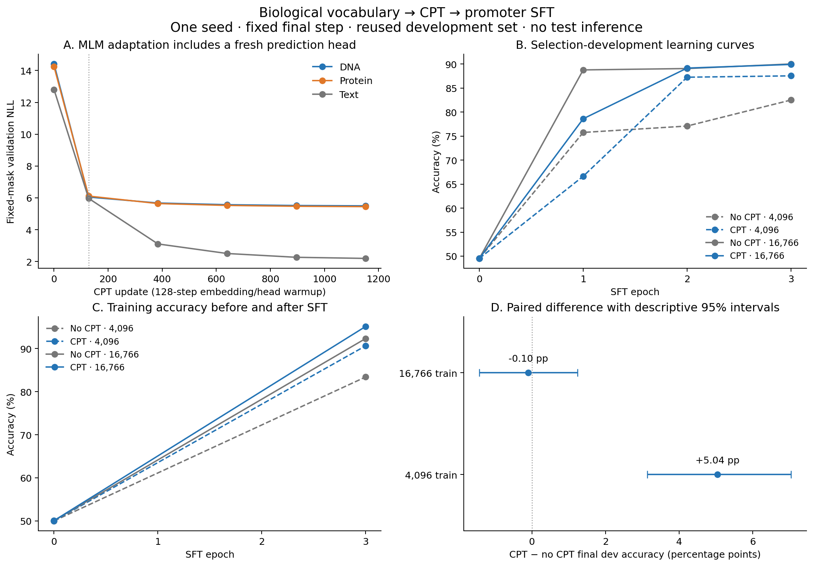

# Biological vocabulary → CPT → conventional SFT: corrected first round

**Complete; all five fits and the independent audit passed.** Experiment dates use UTC (2026-09-24). The old interface/GFP diagnostic route remains paused.

**Main finding:** on promoter detection, CPT improves final development accuracy by **5.04 percentage points with 4,096 labels**, while the **16,766-label comparison is effectively tied** (−0.10 pp). This supports an adaptation benefit at the smaller of the two tested label budgets under this recipe. It does not establish that CPT always helps, that 4K is few-shot, or that MLM adaptation creates zero-shot classification.

## Final paired results

The endpoint is fixed at three SFT epochs, using the same original encoder initialization before adaptation, expanded vocabulary, fresh mean-pooling/LayerNorm/dropout/linear classifier, seed, data/order, optimizer schedule and batch size within each pair. Development has 1,052 existing selection-dev examples. No test inference was performed.

| Training examples | Arm | SFT updates | Train accuracy | Dev accuracy | Dev macro-F1 | Dev NLL |
|---:|---|---:|---:|---:|---:|---:|
| 4,096 | No additional CPT | 192 | 83.40% | 82.51% | 0.8244 | 0.3873 |
| 4,096 | CPT | 192 | 90.62% | 87.55% | 0.8755 | 0.3033 |
| 16,766 | No additional CPT | 786 | 92.32% | 90.02% | 0.9002 | 0.2511 |
| 16,766 | CPT | 786 | 95.12% | 89.92% | 0.8992 | 0.2446 |

| Label budget | CPT − no CPT accuracy | Descriptive paired-group 95% interval |
|---:|---:|---:|
| 4,096 | +5.04 pp | [+3.14, +7.03] pp |
| 16,766 | -0.10 pp | [-1.43, +1.24] pp |

The intervals use 10,000 paired bootstrap replicates over the 1,052 existing development groups. They describe uncertainty on this reused development set, not training-seed variability or a fresh blind test. The full-data difference is one additional error for CPT out of 1,052 examples; its interval includes zero.

At 4K, class-0/class-1 recall changes from 89.44%/75.71% without CPT to 89.64%/85.50% with CPT. At full data, recall changes from 90.21%/89.83% to 88.10%/91.71%: the class tradeoff yields nearly identical total accuracy. Full-data CPT has slightly lower NLL (0.2446 versus 0.2511), while its training accuracy is higher (95.12% versus 92.32%). Better training fit has not translated into higher development accuracy at that budget.

The no-CPT arm also improves when moving from 4K to full data (82.51% → 90.02%). That comparison changes both distinct labeled examples and optimizer updates (192 → 786), so it cannot attribute the entire change to label count alone. The CPT effect is estimated separately within each matched-size pair.

## Learning curves and endpoint discipline

[Vector PDF](../artifacts/laya_biocpt_v2/analysis/learning_curves.pdf). Training accuracy is evaluated only before and after SFT; the training panel connects these two observed endpoints.

| Arm | Epoch 1 dev accuracy | Epoch 2 | Epoch 3, primary |
|---|---:|---:|---:|
| No CPT · 4,096 | 75.76% | 77.09% | 82.51% |
| CPT · 4,096 | 66.63% | 87.26% | 87.55% |
| No CPT · 16,766 | 88.78% | 89.07% | 90.02% |
| CPT · 16,766 | 78.61% | 89.16% | 89.92% |

CPT trails after epoch one in both data regimes. The final comparison uses the predeclared third-epoch endpoint; no early stopping, best-checkpoint selection, threshold adjustment, or result-driven SFT hyperparameter change was applied. The early class bias and the full-data tie are retained in the record.

The repeated no-CPT 4K run matches all 192 loss/gradient trace entries (excluding elapsed seconds) and all six saved train/dev prediction files from the previous source revision exactly. This verifies unchanged supervised behavior after the protein-source correction; it is a same-seed repeat, not a new seed.

## Source-quality correction

A whole-file scan of local historical `protein_uni_16.txt` found **zero N/n characters in 16,955,660,631 bytes**, with a hash identical to its archived source manifest. N is a canonical amino-acid residue, so this source is rejected for continued broad protein CPT. The upstream cause is unknown; the current sampler does not delete N. The source bytes and the old-source +5.23 pp 4K result remain visible as a [superseded diagnostic](laya_biocpt_source_diagnostic.md), not the primary corrected result.

The corrected source is local historical `protein_lucaone_15g.txt`. Its admitted training snapshot contains all 20 canonical residues, including 459,623 N characters. A new hard composition gate runs before vocabulary fitting, the production controller requires its passing audit, and an end-to-end negative test rejects the previous source specifically for missing N. DNA BPE and all three promoter SFT files retain identical hashes; protein samples/BPE are rebuilt and the entire SFT matrix is repeated. See the [source-quality evidence and correction](laya_protein_source_quality.md). Presence of all canonical residues does not certify every upstream processing step or provenance claim.

## Embedding adaptation and actual exposure

The original 50,368-entry vocabulary expands to 52,412 entries: 1,022 new DNA IDs and 1,022 new protein IDs, fitted only on admitted CPT training samples. New rows start at the mean of the original embeddings of the raw text fragments. Original IDs and rows are unchanged at initialization; biological encoding round-trips exactly.

CPT uses 128 new-row/MLM-head warmup updates and 1,024 full-encoder updates, effective batch 32 with 14 DNA / 14 protein / 4 text examples. During warmup, old-row gradients are masked, the tied embedding group has zero AdamW weight decay and fresh state, and encoder matrices are frozen. **Actual old-row values remain exactly invariant at every warmup update.** Full CPT removes the mask, unfreezes the encoder, and starts the declared full-phase optimizer. Input embeddings and the MLM decoder remain tied.

Independent replay confirms 16,128 DNA + 16,128 protein + 4,608 text presentations, **6,770,136 input tokens** including prefixes/specials, and **990,605 masked targets**. The larger prepared snapshot has 73,728 sequences / 13,611,857 tokens; it was not all consumed.

Coverage is separated from mere decoder gradients: 2,040 added IDs occur naturally before masking; 2,039 retain at least one natural input occurrence after corruption; 2,039 appear as prediction targets; 2,038 meet both the visible-natural-input and target criteria. DNA:N and protein:J/O/U/Z lack natural visible input in the actual run. Protein U is present once but that occurrence is masked; protein B is visible but receives no prediction target. Reserve/rare symbols are not described as fully trained.

Protein **N** receives **27,991 pre-corruption natural occurrences, 24,210 natural visible input occurrences, 4,196 prediction targets, and 0.32335 L2 embedding change**. Another 50 N inputs come from random replacements, counted separately. “Natural visible” means the corrupted input ID retains its original value; replacement counts identify changes to another BIO ID.

## MLM validation

The original checkpoint lacks its upstream MLM prediction head, so a fresh head is initialized and trained. MLM loss reduction includes head learning and is not alone evidence of downstream usefulness, language retention, or zero-shot ability.

| Step | Phase | DNA NLL | Protein NLL | Text NLL |
|---:|---|---:|---:|---:|
| 0 | initial | 14.4109 | 14.2515 | 12.8064 |
| 128 | warmup | 6.0509 | 6.1106 | 5.9664 |
| 384 | full | 5.6757 | 5.6424 | 3.1054 |
| 640 | full | 5.5694 | 5.5244 | 2.5040 |
| 896 | full | 5.5178 | 5.4718 | 2.2655 |
| 1152 | full | 5.4975 | 5.4491 | 2.1957 |

## Verification, artifacts and limits

The [independent audit](../artifacts/laya_biocpt_v2/analysis/audit.json) passes all 24 train/dev metric points with sklearn; replays all 1,152 CPT sampling/masking updates; exactly matches saved sampler and mask RNG state; verifies all retained model hashes, paired classifier initialization and batch order; recomputes residue composition; and confirms a nonzero encoder matrix update. Stored FP32 probability sums deviate from one by at most 8.75e-08; only this numerical roundoff is normalized for the independent FP64 NLL check, without changing saved predictions.

All five final model reload checks reproduce predictions exactly. The final CPT model and optimizer/RNG/sampler state and both full-data SFT models are retained locally. The continuation optimizer contains 173 parameter states at full-phase step 1,024. Small-data model files are removed only after verified reload under the frozen storage policy; every prediction remains in the archive.

The corrected five-fit round ran from 2026-09-24T15:30:45.527107+00:00 to 2026-09-24T16:41:17.979118+00:00 (70.54 minutes), excluding initial implementation, preprocessing, and the superseded-source diagnostic.

- [Machine-readable summary](../artifacts/laya_biocpt_v2/analysis/summary.json), [exposure-by-token audit](../artifacts/laya_biocpt_v2/analysis/actual_token_exposure.json), and [evidence archive](../artifacts/laya_biocpt_v2/README.md).
- [Frozen v2 plan](../artifacts/laya_biocpt_v2/round/EXPERIMENT_PLAN.md), [active plan](../refine-logs/EXPERIMENT_PLAN.md), and [prior-route pause record](../refine-logs/ROUTE_CHANGE_20260924.md).

Local complete artifacts: `/root/autodl-tmp/jev_gene/artifacts/laya_biocpt_v2`. Large raw/encoded data and model/optimizer files are not in Git. The source-correction code/recipe was published at `e8d28fc053ae990b5a8c8ee3d6a36fc74bdfe375` before corrected downstream results. Curated prediction JSONL files are gzip-compressed losslessly with deterministic timestamps.

Limitations: one seed and one supervised task; previously used development memberships; one shared fixed SFT recipe; and fixed epochs rather than equal update budgets across label counts. Random-byte corpus sampling is length-biased. Long-kmer exclusion (31 DNA bases on both strands / 15 amino acids) removes admitted lines overlapping protected sequences but does not prove global homology or parent independence. Held-out sequences are used for exclusion only, without target-based selection or test inference. New tasks require new admission checks.

This is a conventional fixed classification head, not the old semantic candidate interface. The next scientific questions are seed robustness, a protein-task anchor with thousands of labels, and a dedicated label-efficiency curve. None of those, nor few-shot or zero-shot classification, is established by this first completed round.
