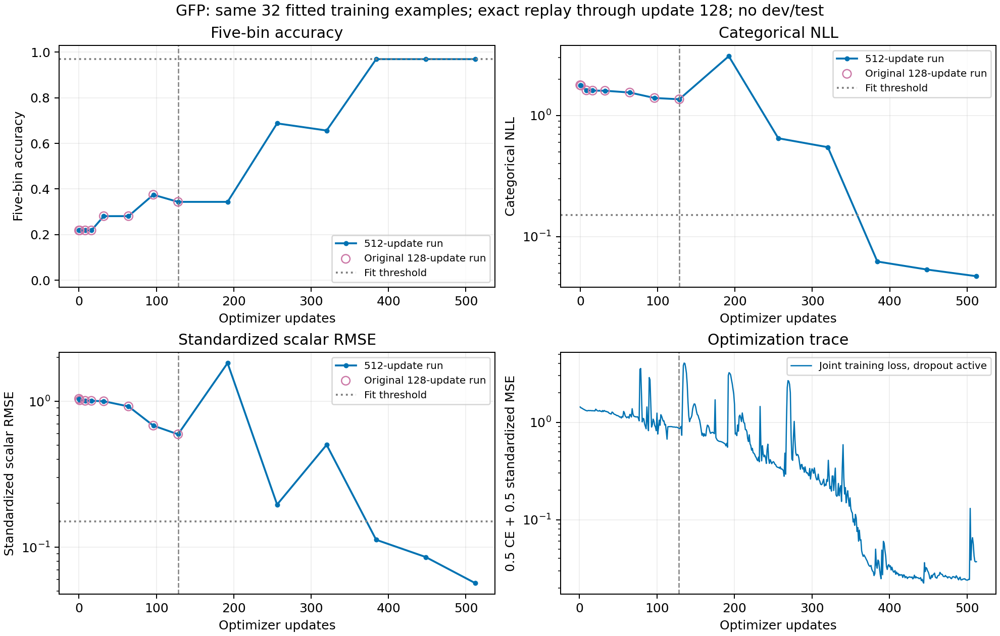

# GFP 读出配置的 128→512 步收敛检查

日期：2026-09-24。**状态：512 步训练、严格前缀复现和保存重载检查全部完成；最终分类与回归均通过预设拟合条件。**

承接 [读出与损失诊断](laya_readout_diagnostics.md)，本轮只增加训练更新数，不新增任务或开发集/测试集评估。

## 固定协议

采用上一轮 MAE/RMSE 最低的多头配置：保留原 Laya typed transformer head 和 type embedding，在所有有效 token 上均值池化，将原 scorer 的共享 readout 替换为新 LayerNorm，接相同初始化的任务分类/回归输出层。使用联合损失 `0.5 CE + 0.5 标准化 MSE`。

仍为相同 32 个 GFP 训练样本、原始 Laya 初始化、seed 20260924、有效 batch 32、micro-batch 4、BF16 autocast / FP32 参数、原 dropout、AdamW、weight decay 0.01、梯度裁剪 1。前 8 步 warmup 到 1e-4，之后保持常数学习率。Score 阈值、anchors 和标准化继续复用原 1,024 个训练样本的定义。唯一训练超参数变化是更新数由 128 增为 512；无提前停止。

保留原有早期评估点，并每 64 步评估同一训练子集。第 128 步必须逐项复现原运行：配置、每步损失/学习率/梯度范数、已记录模块梯度范数、最终指标和全部逐样本概率/标量预测。时长不要求一致。若任何优化或预测值不一致，终止，不进入后续 384 步。

判定标准保持不变：分类 Accuracy ≥31/32 且 NLL ≤0.15；标量标准化 RMSE ≤0.15。分别报告首次观测到通过的评估点和最后一步状态，不挑选中途的最好结果代替最终结果。

本轮配置是根据前期训练诊断选择的，属于事后收敛检查，不是预注册的架构比较。512 步对应更多样本曝光，不能与候选评分器的 128 步结果直接声称等预算优劣。最终 FP32 checkpoint 经保存重载检查后保留在本地，不上传大模型权重。

## 结果

从原始 Laya 权重重新训练，前 128 步已逐项精确复现原运行：

- 128 条优化记录一致，包括损失、学习率、梯度范数和记录过的模块梯度范数。
- 损失与梯度范数最大差均为 0。
- 32 个样本的概率和标量预测逐项一致，最大差均为 0。
- 第 128 步全部评价指标一致；MAE 为 0.27958，RMSE 为 0.48177，五档 Accuracy 为 34.38%。

最终第 512 步，两项拟合条件均通过。第 384 步首次观测到同时通过，第 448 和 512 步继续通过。这里的“首次”指已记录的评估点，不代表准确的跨阈值更新时刻。

| 更新步数 | 五档 Accuracy | NLL | 标量 MAE | 标量 RMSE | Spearman | 同时达标 |
|---|---:|---:|---:|---:|---:|---|
| 128 | 34.38% | 1.36130 | 0.27958 | 0.48177 | 0.60725 | 否 |
| 192 | 34.38% | 3.08852 | 1.19923 | 1.48368 | 0.75953 | 否 |
| 256 | 68.75% | 0.64856 | 0.12367 | 0.15890 | 0.96746 | 否 |
| 320 | 65.62% | 0.54733 | 0.30858 | 0.40806 | 0.93679 | 否 |
| 384 | 96.88% | 0.06224 | 0.07381 | 0.09110 | 0.96180 | 是 |
| 448 | 96.88% | 0.05344 | 0.05110 | 0.06939 | 0.96827 | 是 |
| 512 | 96.88% | 0.04707 | 0.03367 | 0.04596 | 0.98588 | 是 |

最终标准化 RMSE 为 **0.05669**，低于 0.15 的阈值；分类仍有 1/32 个样本错误，但 Accuracy 96.88%、NLL 0.04707 均满足事先固定的门槛。

曲线并非单调改善：第 192 步的分类和回归误差明显反弹，第 320 步回归也回落。没有改变学习率、提前停止或挑选中间最佳 checkpoint；表中保留这些波动，最终结果取第 512 步。末尾三个评估点均达标，只能说明这些已观测点保持了拟合，不能推断每一个中间更新都达标或不同随机种子也同样稳定。

## 输入依赖与数值检查

将同一批样本的输入序列轮换、保留原标签后，五档 Accuracy 从 96.88% 降到 **15.63%**；标量 MAE 从 0.03367 升到 **0.88310**，Spearman 从 0.98588 降到 **−0.05447**。模型的训练内预测依赖序列差异，但这不是未见样本泛化检查。

512 条优化记录的损失与梯度范数均有限。保存再重载后的概率和标量预测最大差均为 0，完整权重 SHA-256 由训练进程和外层运行器分别核验。新加入的前缀比较测试验证：允许时长不同，但损失、学习率、梯度范数或模块梯度变化都会被检测；本轮 5 项相关测试通过。

运行从 **09:43:28 到 09:59:24 UTC**，总跨度约 **15.94 分钟**；训练及周期评估约 **15.41 分钟**，训练期间峰值分配显存约 **7.84 GiB**。本次共 16,384 次训练样本呈现，其中前 4,096 次重放原 128 步，后 12,288 次为增加的训练预算。

最终 FP32 checkpoint 约 1.68 GB，保留于本地 `artifacts/laya_multitask_v2/convergence_v1/native_readout_512/checkpoint/`（原实验工作目录）。Git 归档包含配置、预测、曲线、哈希和冻结代码，不包含大模型权重。权重 SHA-256：

`08726232b9b18744940d5e2a8eaee0169d807f3131d0d5af68e28de951725822`

## 对下一步实验的影响

对选定的新读出配置，128 步不足以达到拟合门槛；仅将更新数增加到 512，便能在相同训练子集上通过分类和原生回归检查。因此不能再把这个配置在 128 步时的失败当作“多头无法学习 GFP”的证据。

这也不意味着历史 CLS/原 readout 配置仅靠加步数一定能解决，或当前学习率就是全量训练的最佳值；那些条件没有在本轮检查。结果仅来自一个随机种子和 32 个有意平衡分档的训练样本。更多曝光与新读出方案共同构成已经验证的具体设置，不支持对未测配置外推。

下一步可以将该读出配置带回 **1,024 个 GFP 训练样本和独立开发集**，记录训练收敛、开发集表现与稳定性，再决定多任务训练方案。512 步不能自动成为更大数据集的最优预算；应在新的训练/开发阶段确定曝光和优化方案，继续保持测试集封存。本轮尚未执行这一步，也没有更新论文中的测试结果。

## 复查入口

- [结果、严格复现记录与冻结代码](../artifacts/laya_convergence/)
- [固定 512 步运行器](../scripts/run_laya_convergence.py)
- [32 样本训练与前缀校验](../scripts/laya_microfit.py)
- [结果核验与学习曲线](../scripts/summarize_laya_convergence.py)

## 后续进展

[1,024 样本训练与开发集验证](laya_gfp_development.md)已完成。512 次更新对应每例 16 次曝光，训练和开发预测仍接近常数，未超过位置岭回归。上述 32 样本拟合结论仍然成立，但没有自动推广为扩大样本后的有效学习。
