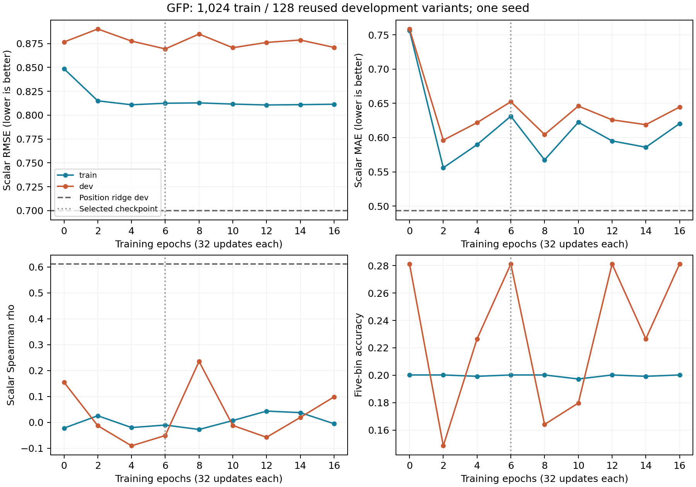

# GFP 扩大训练集后的开发集验证

本轮固定使用 1,024 条训练数据与 128 条开发集数据，从原始 Laya 预训练权重重新训练 512 次更新（16 轮）。保留 typed transformer head 与 type embedding，采用 mean pooling、新建 LayerNorm、五档分类与连续标量联合损失。最佳开发集 scalar RMSE 出现在 **step 192 / epoch 6**。完整预算已结束，无提前停止。本轮所选模型的开发集 RMSE 未超过位置岭回归对照。

## 开发集结果

主要指标预先指定为连续标量 RMSE；五档分类及 anchor 期望值为辅助输出。表内历史 CPU 对照采用同一 GFP 划分，其超参数当时固定，未在本轮重新选择。

| 模型/对照 | MAE ↓ | RMSE ↓ | Spearman ↑ |
|---|---:|---:|---:|
| 训练均值常数 | 0.62927 | 0.87504 | 未定义（常数） |
| 训练中位数常数 | 0.56232 | 0.98299 | 未定义（常数） |
| 位置 one-hot 岭回归 | 0.49300 | 0.69972 | 0.61116 |
| 本轮初始化 | 0.75866 | 0.87665 | 0.15491 |
| 本轮开发集选定（step 192） | 0.65239 | 0.86940 | -0.05067 |
| 本轮最终（step 512） | 0.64464 | 0.87097 | 0.09844 |

选定 checkpoint 的训练集 MAE / RMSE / Spearman 为 0.63121 / 0.81247 / -0.01035。最终训练集对应为 0.62045 / 0.81142 / -0.00521。选定/最终模型在开发集上的预测标准差分别为 0.000461 / 0.000831，真实开发集标准差为 0.867089。低方差预测的微小 RMSE 改善可能仅来自均值偏移，应结合排序相关性和训练误差解释。开发集挑选会使所报告的最佳值偏乐观；同时保留固定最终步结果。

## 完整学习曲线

| 更新 | 训练轮数 | Train scalar RMSE | Dev scalar RMSE | Dev scalar MAE | Dev scalar ρ | Dev 五档准确率 |
|---:|---:|---:|---:|---:|---:|---:|
| 0 | 0 | 0.84858 | 0.87665 | 0.75866 | 0.15491 | 28.12% |
| 64 | 2 | 0.81500 | 0.89026 | 0.59628 | -0.01281 | 14.84% |
| 128 | 4 | 0.81086 | 0.87760 | 0.62182 | -0.09049 | 22.66% |
| 192 | 6 | 0.81247 | 0.86940 | 0.65239 | -0.05067 | 28.12% |
| 256 | 8 | 0.81284 | 0.88497 | 0.60448 | 0.23523 | 16.41% |
| 320 | 10 | 0.81160 | 0.87063 | 0.64604 | -0.01188 | 17.97% |
| 384 | 12 | 0.81065 | 0.87619 | 0.62596 | -0.05754 | 28.12% |
| 448 | 14 | 0.81099 | 0.87872 | 0.61887 | 0.01911 | 22.66% |
| 512 | 16 | 0.81142 | 0.87097 | 0.64464 | 0.09844 | 28.12% |

## 冻结的训练协议

- 单 seed 20260924；从原始预训练模型初始化，未使用前一轮 32 样本过拟合权重。全参数训练，模型可训练参数 420,010,014（保留全部任务头，但本轮仅 GFP 有训练样本）。
- 每轮独立打乱全部 1,024 样本，每条恰好出现 16 次；总曝光 16,384 次。前一轮 32 样本实验同为 512 次更新，但每例出现 512 次；本轮每例仅 16 次，不能把相同更新数当成相同的逐样本训练深度。有效 batch 32，micro-batch 4，BF16 autocast、FP32 权重，AdamW weight decay 0.01、梯度裁剪 1.0。
- 学习率 16 次更新线性 warmup 至 1e-4，随后余弦下降，step 512 为 1e-5。此设置在启动前冻结；与小样本轮次相比，样本规模、曝光次数和学习率日程均变化，不能单独归因到某一结构改动。
- 损失为 0.5 × 五档 CE + 0.5 × 标准化连续值 MSE；分箱、anchors、均值和标准差均沿用训练集定义。未用开发集拟合标准化参数。
- 初始及每 64 次更新分别全量评估训练集和开发集。预先按最小开发集 scalar RMSE 选权重，含 step 0、相同值优先更早一步；只保留一份选定权重，全部评估点及最终预测均保留。

## 数据边界与证据范围

读取固定 manifest 下的 train/dev 文件并校验 SHA-256。GFP 来源为 TAPE 的 train/valid，训练/开发之间 ID、完整 inputs 和 group 交集均为 0。本轮未读取 TEST。开发集在历史诊断中已使用，属于**重复使用的开发集**；GFP 变体共享母体蛋白，没有跨家族独立性的保证。单 seed、1,024/128 规模结果不是确认性测试，也不支持候选评分器与共享头的架构优劣结论。

## 验证、耗时与产物

全部 512 次 loss/梯度有限；逐轮批次核对确认无遗漏/重复，每例恰好 16 次。全部 9 个评估点的预测 RMSE 已独立重算；最佳步选择与冻结源文件哈希通过。选定权重重载后概率最大差 0，标量最大差 0。

训练、周期评估及加载累计 14.61 分钟，峰值 allocated 显存 7.84 GiB；显卡为 NVIDIA GeForce RTX 4080 SUPER。本地保留权重（仅模型状态，无优化器状态）：`/root/autodl-tmp/jev_gene/artifacts/laya_multitask_v2/gfp_development_v1/run/checkpoint/model.safetensors`，SHA-256 `d789397bfeffcbb6440723bc6e5d6e51b803f7ce885976c9de9ae374626d77d2`。磁盘限制下不另存最终步权重（若与最佳步不同），最终步预测仍完整保留。

- [完整汇总](../artifacts/laya_gfp_development/summary.json)、[对照与审核](../artifacts/laya_gfp_development/comparison.json)
- [训练逐步记录](../artifacts/laya_gfp_development/training.jsonl)、[学习曲线数值](../artifacts/laya_gfp_development/learning_curve.jsonl)
- [运行配置](../artifacts/laya_gfp_development/run_config.json)、[冻结代码](../artifacts/laya_gfp_development/frozen_code/)
- [训练脚本](../scripts/laya_gfp_development.py)、[汇总脚本](../scripts/summarize_laya_gfp_development.py)
- [前一轮 32 样本拟合](laya_convergence.md)、[历史开发集与 CPU 对照](laya_task_diagnostics.md)
