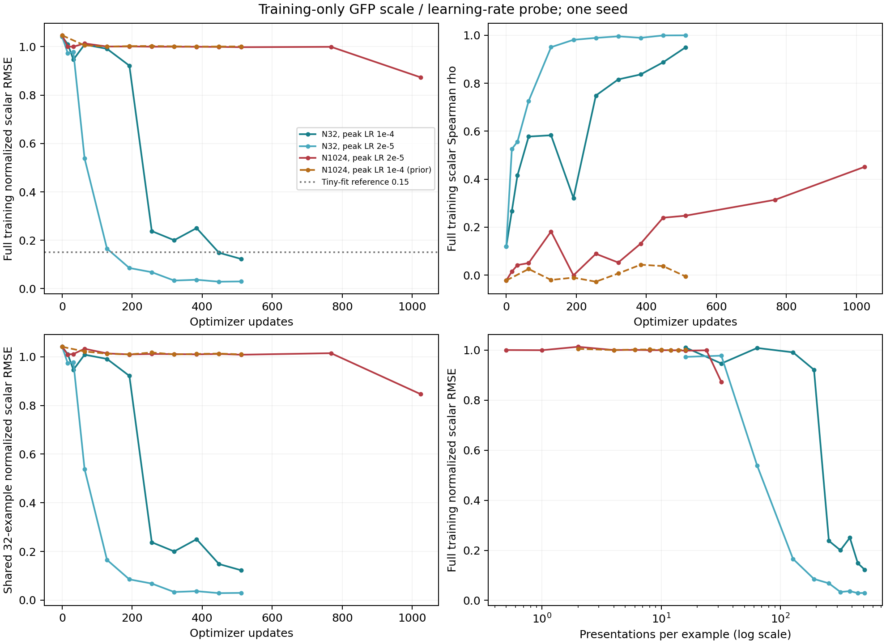

# GFP 训练规模、学习率与曝光次数诊断

本轮新增三次训练，只读取训练样本，复用上一轮 1,024 样本高学习率的训练预测作为第四个对照。三个新实验均完成，无提前停止；新训练共 2,048 次更新。实验比较按启动前冻结的预算报告，未按结果追加参数搜索或开发集评估。

## 主要观察

1. **降低学习率改善了固定小样本拟合。**同样 512 次更新，32 样本 RMSE 从 0.09930 降至 0.02420。高学习率组只通过标量拟合参考线，NLL 0.20514 未达到 0.15；低学习率组最终两项均通过。
2. **在大样本、相同 512 步预算下，单独降低学习率没有恢复有效幅度的连续值拟合。**RMSE 从 0.81142 变为 0.80900，仍接近均值预测；排序信号有所改善。
3. **延长低学习率大样本训练产生了实质改善，但仍欠拟合。**第 1,024 步 RMSE 0.70786，较第 512 步下降 12.50%，预测标准差增至 0.34182、Spearman 为 0.45168。第 768 步尚未出现同等改善，不能把这条稀疏评估曲线描述为全程单调收敛。

本轮支持继续研究训练预算与优化轨迹，尚不能把大样本问题归结为模型容量不足。没有运行大样本高学习率的 1,024 步对照，因此不清楚其延长后是否也会改善；也没有验证跨 seed 或开发集表现。

## 相同更新预算：2 × 2 对照

固定第 512 次更新，比较 32／1,024 样本与学习率峰值 1e-4／2e-5。高学习率日程为 16 步 warmup + 余弦下降到 1e-5；低学习率将整个日程乘以 0.2。每例曝光数分别为 512 与 16，所以此表是相同更新数／总样本曝光量的比较，不是相同逐样本训练深度。

| 条件 | Train MAE ↓ | Train RMSE ↓ | 标准化 RMSE ↓ | Spearman ↑ | 预测标准差 | 五档准确率 | NLL ↓ |
|---|---:|---:|---:|---:|---:|---:|---:|
| N32, peak LR 1e-4 | 0.06745 | 0.09930 | 0.12250 | 0.94957 | 0.794851 | 96.88% | 0.20514 |
| N32, peak LR 2e-5 | 0.02048 | 0.02420 | 0.02985 | 0.99982 | 0.822620 | 100.00% | 0.00309 |
| N1024, peak LR 1e-4 (prior) | 0.62045 | 0.81142 | 1.00097 | -0.00521 | 0.000497 | 20.02% | 1.60979 |
| N1024, peak LR 2e-5 | 0.60403 | 0.80900 | 0.99797 | 0.24780 | 0.006135 | 19.92% | 1.60826 |

标准化采用同一份 1,024 条训练数据定义的标准差 0.81064118。0.15 是沿用的小样本标量拟合参考线，不是泛化标准。32 样本分类拟合参考为准确率 ≥31/32 且 NLL ≤0.15；大样本分类结果报告为连续诊断值。

## 同一轨迹上的预算延长

1,024 样本、低学习率实验在第 512 步后保持学习率 2e-6，继续至 1,024 步。第 512／768／1,024 步分别对应每例 16／24／32 次曝光；没有重启优化器或更换训练样本。

| 更新 | Train MAE ↓ | Train RMSE ↓ | 标准化 RMSE ↓ | Spearman ↑ | 预测标准差 | 五档准确率 | NLL ↓ |
|---|---:|---:|---:|---:|---:|---:|---:|
| 512 | 0.60403 | 0.80900 | 0.99797 | 0.24780 | 0.006135 | 19.92% | 1.60826 |
| 768 | 0.56264 | 0.81015 | 0.99939 | 0.31410 | 0.008394 | 20.02% | 1.61456 |
| 1024 | 0.53813 | 0.70786 | 0.87320 | 0.45168 | 0.341816 | 32.13% | 1.51679 |

最终标准化 RMSE 为 0.87320，尚未达到 0.15 的拟合参考线。额外预算已经改善误差，但当前预算尚不足以实现充分拟合，不能把剩余误差唯一归因于样本规模。

## 相同逐样本曝光次数的补充读数

| 每例曝光 | 学习率档位 | N32 全部样本 RMSE | N1024 全部样本 RMSE | N1024 中共享 32 条 RMSE |
|---:|---|---:|---:|---:|
| 16 | high | 0.81928 | 0.81142 | 0.81863 |
| 16 | low | 0.78883 | 0.80900 | 0.81760 |
| 32 | low | 0.79271 | 0.70786 | 0.68620 |

高学习率大样本历史对照只有 16 次曝光，故没有其 32 次曝光读数。低学习率小样本在 16／32 次曝光时也未达到拟合参考线，因此不能用小样本 512 次曝光的成功，要求大样本在 16／32 次曝光时达到同样效果。这些补充比较仍改变了更新数和学习率历史；完全匹配大样本每例 512 次曝光需要 16,384 次更新，未在本轮固定预算内执行。**本轮没有完全分离样本规模与曝光次数的因果作用。**

## 与已成功的小样本实验的关系

32 条数据与此前成功拟合的子集逐 ID、顺序核对一致。此前 8 步 warmup 后恒定 1e-4、512 更新的标量 RMSE 为 0.04596；本轮 32 样本高学习率臂改用 16 步 warmup + 余弦下降，RMSE 为 0.09930。这项比较检验整个学习率日程变化，不能单独区分 warmup 与衰减的作用。

曲线同时展示全训练样本与所有条件共享的 32 条训练样本，以避免只比较不同大小面板的总体均值。最后一幅图按每例曝光次数绘制，但跨样本规模的相同曝光点具有不同更新数与学习率历史，不能作纯粹的样本规模因果估计。所有原始评估点和该比较的数值均保留在 comparison.json。

## 协议与核验

- 单 seed 20260924；每次从同一原始预训练权重初始化，保留 typed head／type embedding，mean pooling + 新建 LayerNorm；0.5 五档 CE + 0.5 标准化标量 MSE。训练参数总数 420,010,014（含未使用任务头）。
- 有效 batch 32、micro-batch 4，AdamW weight decay 0.01，clip norm 1，BF16 autocast／FP32 权重。全部条件保持模型、损失和训练集定义的分箱／anchors／标准化一致。
- 同规模的高／低学习率臂初始预测一致、前 512 步批次 ID 顺序一致；大样本低学习率与历史对照初始预测完全一致。两档逐步学习率比值为 0.2。每次评估前后 CPU／CUDA RNG 状态一致，评估不会扰动后续训练随机轨迹。
- 全部 2,048 次新训练损失和梯度有限；每轮完整覆盖样本、累计曝光次数准确；全部训练和共享 32 条样本的指标从预测重算一致。三个最终 checkpoint 保存重载概率和标量最大误差均为 0；源代码、历史训练预测和权重 SHA-256 均通过。
- 没有读取新的 dev 或 test 数据。历史大样本对照仅复制 training.jsonl 与 train_step*_predictions.jsonl，没有复用其开发集结果进行本轮选择。该配置此前受开发诊断启发，不能称为从未接触开发信息的研究。
- 三次新训练合计 55.00 分钟，固定完成后只保留各自最终模型状态，无优化器状态。单 seed 与有限超参数点限制结论，不作为模型架构优劣或泛化证据。

## 后续决策

下一步优先在固定低学习率轨迹上进行更长的训练收敛验证，例如预先冻结 2,048 次更新预算，再考虑新的开发集评估。当前仅保留模型权重，没有优化器状态；若要求严格的预算延长对照，需要从原始初始化重放并核验前 1,024 步，再延长，不能将重新初始化 AdamW 的继续训练称为同一轨迹。此后续尚未执行，当前不扩大多任务评测。

## 产物

- [比较与检查结果](../artifacts/laya_gfp_scale_probe/comparison.json)、[冻结协议与运行状态](../artifacts/laya_gfp_scale_probe/status.json)
- [全部轻量记录与预测](../artifacts/laya_gfp_scale_probe/)、[训练脚本](../scripts/laya_gfp_scale_probe.py)、[队列脚本](../scripts/run_laya_gfp_scale_probe.py)
- [上一轮 1,024 样本开发验证](laya_gfp_development.md)、[32 样本拟合成功记录](laya_convergence.md)

本地保留的最终权重（未上传 Git）：

- `n32_high`：`/root/autodl-tmp/jev_gene/artifacts/laya_multitask_v2/gfp_scale_probe_v1/n32_high/checkpoint/model.safetensors`；SHA-256 `14b6306a61b022d03b5fc86ad3648405abf4b5ada090534fbd55a9aeeca41504`。
- `n32_low`：`/root/autodl-tmp/jev_gene/artifacts/laya_multitask_v2/gfp_scale_probe_v1/n32_low/checkpoint/model.safetensors`；SHA-256 `591759a3f9151822e5e8de162722b3838a6e984a5774a6b86c90839f009a4f51`。
- `n1024_low`：`/root/autodl-tmp/jev_gene/artifacts/laya_multitask_v2/gfp_scale_probe_v1/n1024_low/checkpoint/model.safetensors`；SHA-256 `8cde4f970d9d48a7604a9d31942f308dd94aa668c1fd04f450b05fdfc41458c6`。
