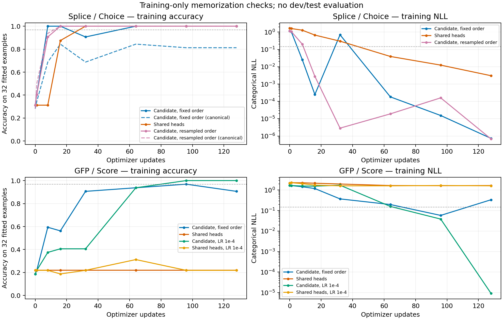

# 固定 32 个训练样本的拟合能力检查

日期：2026-09-24。**状态：七次训练及全部候选排列检查已完成。** 范围：剪接 Choice 与 GFP Score 的训练内诊断，**不读取开发集或测试集样本，不评估泛化**。本轮从原始 Laya 权重开始，沿用已记录的剪接名称修正版本；完整上游谱系仍未完全核实，见 [前一轮诊断](laya_task_diagnostics.md)。

## 固定协议

每个任务仅从已有训练集选 32 个样本。按数字类别分层，用固定 SHA-256 排序选样：剪接三个类别为 `[11, 11, 10]`，GFP 五个 bin 为 `[7, 7, 6, 6, 6]`。两个模型使用相同子集。GFP 的阈值、anchors 和标量标准化保持由原来的 1,024 个训练样本确定，不重新拟合这些定义。

初始四次运行是两任务 × 候选评分器/共享多头，各 **128 步**。每步使用完整 32 个样本，micro-batch 4，BF16 autocast、FP32 权重、AdamW、weight decay 0.01、梯度裁剪 1。学习率前 8 步线性升到 **2e-5**，之后保持不变；保留模型原有 dropout，无提前停止。

预先固定的训练拟合通过条件：最终训练排列上的 Accuracy ≥ **31/32**，且分类 NLL ≤ **0.15**。同时报告途中首次观测到通过的步数，区分“曾经拟合”与“最终稳定拟合”。对 Score，这个条件检查五档分类学习，不能代替连续回归误差或泛化评估。若候选评分器最终不通过，仅增加一次从头开始、只将学习率改为 **1e-4** 的 128 步对照；最多两个这样的补充运行。

这轮故意提高每个样本的重复曝光并平衡类别，学习率计划也与之前的余弦衰减不同。因此它用于检查训练通路是否具备记忆能力，不能把改善单独归因于某一个超参数，也不是与六任务实验等预算的效果比较。

## 数据与梯度检查

每个子集有 32 条不同序列、32 个不同分组；两种模型的完整 token 输入也各有 32 种，不存在序列被编码成同一输入的情况，UNK 为 0。剪接输入为候选评分器 206–227 tokens、多头 188–209 tokens；GFP 分别为 239–243 / 151–155 tokens，均未截断。

训练内的位置 one-hot 逻辑回归可在两个子集上达到 **100%** 分类准确率。GFP 的位置岭回归在这 32 个样本上的 MAE 为约 **1.72e-7**。这些是故意弱正则的训练拟合正对照，没有任何开发集选择或泛化含义。

运行记录抽样保存 encoder、附加 head、类型 embedding、scorer/分类头的梯度范数，并校验参数保存后的概率与标量重载一致性。用于动作路由的辅助 act head 保持原设计冻结，不参与分类损失。

## 剪接候选顺序诊断

候选评分器原协议为“每个训练样本固定一种随机排列”，所以同时评估原训练排列与标准排列。两者都按真实生物类别坐标计算指标，不能直接把每条样本不同的候选位置当成同一类别；相应坐标转换有回归测试。

初始剪接评分器在第 16 步已经达到训练排列 100%，但标准排列只有 84.38%；最终第 128 步为 **100% / 81.25%**。保持问题和标签、将输入序列轮换到其他样本后，标准排列准确率降至 **28.13%**。这表明模型使用了序列内容，同时仍存在顺序依赖。

据此增加一项**看到拟合曲线后提出的诊断对照**：每一步为每个样本重新随机候选排列。保持相同 32 个样本、初始化、128 步、学习率、dropout 和损失。条件是初始剪接评分器通过训练排列拟合条件而未通过标准排列条件；不是根据 dev/test 成绩选择方案。随后用三类候选的全部六种统一排列，检查同一批训练样本的预测一致性。

GFP 候选评分器在原学习率下曾于第 96 步通过阈值，但最终回落到 90.63%，因此按既定规则触发 1e-4 对照。该对照最终达到 100% 五档准确率和约 9.20e-6 的 NLL。随后，为避免把优化差异误解为架构差异，再给未通过的 GFP 多头分支补一个相同 1e-4 学习率的运行；这是额外的事后诊断，不属于最初的四次基础运行或候选评分器条件分支。

候选重排也接入了通用训练入口的可选参数 `--resample-choice-order`。它只改变 Choice 面板，每次重排同步转换金标签位置，Score 和 Noul 的顺序保持不变。默认行为保留历史实验，新的训练必须显式开启。微型顺序对照与通用入口使用同一个重排函数；包含样本、类别语义不变与不修改原对象的测试。

## 执行与结果

全部七次均完成 128 步，共 896 次更新，每次运行 4,096 次样本曝光。训练队列从 **07:27 到 07:56 UTC**，跨度约 **28.83 分钟**；训练及其中的周期评估合计 **25.26 分钟**。七个 checkpoint 哈希与记录一致，896 条损失/梯度记录有限，重载概率和标量最大差均为 0。十项单元/回归测试通过。

| 任务 / 模型 | 学习率 | 最终训练参考排列 Accuracy | 最终标准排列 Accuracy | 分类 NLL（标准排列） |
|---|---:|---:|---:|---:|
| 剪接候选评分器，固定排列 | 2e-5 | 100% | 81.25% | 1.79247 |
| 剪接共享多头 | 2e-5 | 100% | 100% | 0.00304 |
| 剪接候选评分器，每步重排 | 2e-5 | 100% | 100% | 7.23e-7 |
| GFP 候选评分器 | 2e-5 | 90.63% | 90.63% | 0.33643 |
| GFP 候选评分器 | 1e-4 | 100% | 100% | 9.20e-6 |
| GFP 共享多头 | 2e-5 | 21.88% | 21.88% | 1.65740 |
| GFP 共享多头 | 1e-4 | 21.88% | 21.88% | 1.60897 |

基础剪接评分器首次观测到满足拟合阈值是在第 8 步，多头在第 64 步；重排版本在第 16 步。GFP 原学习率在第 96 步一度达标但最终未达标；提高学习率后第 96 步及最终均达标。这里报告最终状态，也保留中途波动，没有用开发集挑选 checkpoint。

GFP 高学习率候选评分器的连续值 MAE 为 **0.10982**、Spearman 为 **0.96848**；已知真实 bin 后直接取训练 anchor 的参考 MAE 为 **0.10982**，表明该模型已把五档分类基本拟合正确。这个参考不是软概率连续解码的严格误差下界。多头标量输出的 MAE 分别为 **0.98978 / 0.71224**，预测标准差分别 **0.02370 / 0.00228**，远小于目标标准差 **0.81859**，仍未通过拟合能力检查。

对同一 32 个剪接训练样本枚举全部六种统一候选排列：

| 训练方式 | 六种排列 Accuracy 范围 | 平均 Accuracy | 六种排列预测全部一致的样本比例 |
|---|---:|---:|---:|
| 每样本固定排列 | 81.25%–100% | 94.79% | 78.13% |
| 每步重新排列 | 100%–100% | 100% | 100% |

这支持在当前小样本上采用候选重排增强，但不证明在未见序列或任务上严格顺序无关。所有六种排列都作用于已参与拟合的序列。

## 对下一轮实验的影响

候选评分器的 Choice/Score 通路能够拟合小样本，没有发现分词输入碰撞、截断或梯度断开阻止学习。下一轮应将 Choice 重排增强纳入训练，并重新确定达到有效训练拟合所需的曝光和优化预算；不能直接把小样本的 1e-4 学习率当作全量多任务的最优值。

GFP 多头分支在两个学习率下都未通过。优先对它做读出方式与损失拆分检查（例如序列池化、独立标量 MSE），再做正式架构比较。现有结果不足以定位唯一原因，也不能把尚未调通的多头分支当作候选评分器的优势证据。尚未开展新的开发集评估、完整数据重训或任务扩展。

完整 [结果与曲线](../artifacts/laya_microfit/) 包含三个队列的状态、源代码快照、数据/初始化哈希和软件版本。

## 可复查实现

- [32 样本训练入口](../scripts/laya_microfit.py)
- [输入审计与位置特征拟合对照](../scripts/audit_laya_microfit_inputs.py)
- [全部候选排列检查](../scripts/evaluate_laya_microfit_orders.py)
- [结果校验与学习曲线生成](../scripts/summarize_laya_microfit.py)
- [样本选择和候选坐标转换测试](../scripts/test_laya_microfit.py)

本轮不新增任务、不使用 dev 调参，也不更新论文中的测试集结果。
