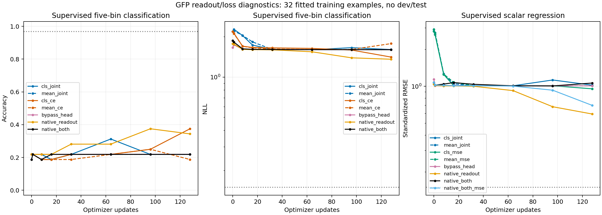

# GFP 多头读出与损失诊断

日期：2026-09-24。**状态：十次运行和保存重载检查全部完成；尚无配置通过最终拟合阈值。**

本轮承接 [32 样本拟合检查](laya_microfit.md)，仅使用训练分区、拟合同一批 32 个 GFP 样本，不使用开发集或测试集，也不更新论文测试结果。

## 已冻结的六组对照

固定原始 Laya 初始化、seed 20260924、32 个 GFP 训练样本、128 次完整 batch 更新、micro-batch 4、BF16 autocast / FP32 参数、AdamW、weight decay 0.01、梯度裁剪 1。前 8 步 warmup 到 1e-4，随后学习率不衰减。样本、五档阈值、anchors、标量标准化定义全部复用上一轮。

| 池化 | 联合损失 | 仅分类 | 仅回归 |
|---|---|---|---|
| CLS | 0.5 CE + 0.5 标准化 MSE；复现原基线 | CE | 标准化 MSE |
| 有效 token 均值 | 0.5 CE + 0.5 标准化 MSE | CE | 标准化 MSE |

均值池化位于原有 typed head 之后、预训练 scorer 的共享 readout 之前；包括问题、序列和特殊 token，排除 padding，**不是只对氨基酸 token 池化**。其余输入和参数初始化不变。

只对受监督的输出判定拟合：分类 Accuracy ≥31/32 且 NLL ≤0.15；标量标准化 RMSE ≤0.15（标准差沿用原 1,024 个训练样本）。仅 MSE 分支的分类头、仅 CE 分支的标量头没有对应监督，不用它们的好坏判断该分支是否成功。单损失分支的系数从联合损失中的 0.5 改为 1，因此结果也包含有效梯度权重变化，不能把任何改善完全归因于梯度冲突的消除。

附加诊断在初始和最终状态测量：encoder、typed head、readout 的 CLS/均值特征跨样本离散度与有效秩；全 32 个训练样本在 eval 模式下，CE/MSE 对共享 readout 参数的梯度范数和夹角。该夹角只覆盖 readout，不代表完整 encoder 的梯度关系，也不能单独证明优化因果。

六组事先固定，无提前停止，均报告最后一步。每组临时保存完整 FP32 模型，重载核对概率和标量输出并计算权重哈希后，移除本轮临时权重以控制磁盘占用；保留配置、预测、曲线、源代码快照和哈希。历史实验权重保持原样。

## 有条件的后续对照

在六组完成前固定条件：若六组均未通过各自受监督输出的拟合阈值，再执行三组均值池化、联合损失的对照——仅绕过附加 typed transformer head、仅将预训练 readout 替换为新 LayerNorm、两者同时替换。保留原 type embedding；各任务输出层使用相同随机初始化。与原均值池化联合损失组形成一个 2×2 结构消融。128 步、1e-4 和样本保持一致；移除模块会改变参数量和计算量，不能当作严格同容量的架构优劣比较。

若两者同时替换后的联合损失仍不能拟合标量，再增加一次同结构的 MSE-only 对照。后续最多四次运行。这些规则是在看到原基线和均值联合损失的早期曲线后制定，属于事后诊断，不是最初六组的一部分。

## 结果

六组固定对照已全部完成，均未通过各自受监督输出的最终拟合阈值。原 CLS + 联合损失的最终指标与上一轮 1e-4 多头运行逐项完全一致。

| 池化 / 损失 | 受监督五档 Accuracy | 分类 NLL | 受监督标量 MAE | 标准化 RMSE |
|---|---:|---:|---:|---:|
| CLS / 联合 | 21.88% | 1.60897 | 0.71224 | 1.02272 |
| 均值 / 联合 | 21.88% | 1.60698 | 0.62346 | 1.01094 |
| CLS / 仅 CE | 37.50% | 1.41258 | — | — |
| 均值 / 仅 CE | 18.75% | 1.78249 | — | — |
| CLS / 仅 MSE | — | — | 0.53944 | 0.95455 |
| 均值 / 仅 MSE | — | — | 0.64159 | 1.00969 |

横线表示该输出没有对应监督，不能作为该运行的评价指标。上述结果支持“在当前预算下，单改池化或改用单一损失仍不足以恢复拟合”，不证明增加训练预算也无效。

触发条件满足，完成三组附加模块消融及一次条件 MSE-only 对照。

| 均值池化下的结构 / 损失 | 受监督 Accuracy | 标量 MAE | 标量 RMSE | Spearman |
|---|---:|---:|---:|---:|
| 原 typed head + 原 readout / 联合 | 21.88% | 0.62346 | 0.81951 | -0.24583 |
| 绕过 typed head，保留原 readout / 联合 | 21.88% | 0.64129 | 0.81856 | −0.01579 |
| 保留 typed head，新 LayerNorm readout / 联合 | 34.38% | **0.27958** | **0.48177** | 0.60725 |
| 绕过 typed head，新 LayerNorm readout / 联合 | 21.88% | 0.80293 | 0.86265 | 0.45814 |
| 绕过 typed head，新 LayerNorm readout / 仅 MSE | — | 0.47282 | 0.56643 | **0.73556** |

同为均值池化和联合损失时，仅替换 readout 将 MAE 降低约 **55.16%**。它有本轮最低 MAE/RMSE，而最后一个 MSE-only 运行的 Spearman 更高；不同指标的最优配置并不相同。最优误差配置的标准化 RMSE 仍为 **0.59430**，高于预设 0.15，分类 Accuracy 也未达到 31/32。**十次运行均未通过各自受监督输出的最终拟合条件。**

原结构、只绕过 typed head、只替换 readout、同时改动两处的可训练参数量分别为 421,059,614、395,867,166、420,010,014、394,817,566。此处只用于定位当前训练设置的瓶颈，不作为等参数量架构比较。

## 表示与输入检查支持什么

原均值池化联合损失模型，最终 readout 的平均跨样本特征标准差约为 0.000193，平均样本对余弦相似度约为 0.9999995。仅替换 readout 后，两个量分别变为约 0.21353 / 0.92752，标量预测标准差为 0.64190。上述表示统计与学习改善相符，但不能单凭高余弦相似度判定“信息被完全抹去”。

对只替换 readout 的模型，保留问题和标签、将输入序列轮换给其他样本后，标量 MAE 从 0.27958 升为 **0.75493**，Spearman 从 0.60725 降为 −0.04938。这说明其训练内预测利用了序列差异；不证明学到了可泛化的生物规律。

原 CLS 联合损失模型初始 readout 上，MSE 梯度范数约 41.05，CE 约 2.72，夹角余弦约 −0.0308。损失贡献不平衡值得关注，但仅 CE 和仅 MSE 都未能解决拟合问题，因此不能把失败归为已经证实的“两个损失梯度冲突”。这些梯度只覆盖 readout，且测于 eval 模式。

## 结论与下一步

本轮结果显示，单换 CLS/均值池化、以及单独使用 CE 或 MSE，都不足以在当前预算下拟合该子集。预训练 readout 的适配方式有明显影响；保留 typed head、用新 LayerNorm 读出可显著改善回归，但尚未调通完整拟合。去掉更多模块也没有自动改善表现。

还不能确定唯一根因，也不能认定某种结构从原理上无法学习。只替换 readout 的曲线在最后阶段仍在降低误差，下一项应是对该配置做**只增加更新数的收敛检查**，保留样本、初始化、学习率和损失定义；例如从 128 延长到 512 步，核对前 128 步轨迹一致。该建议未在本轮执行。后续的 [512 步严格复现与收敛检查](laya_convergence.md) 现已完成：选定的新读出配置最终通过分类与回归拟合门槛；该结果不适用于未测试的配置。通过训练拟合检查后，再回到 1,024 训练样本及独立开发集验证，之后才扩展任务或做正式架构比较。

不能把未调通的多头对照作为候选评分器架构优势的证据。此处未增加开发集或测试集推理，也未更改论文测试结果。

## 实现与复查

通用训练入口现在支持可选的 `--pooling cls|mean`、`--score-loss joint|ce|mse`、`--bypass-shared-head`、`--native-readout`，仅对共享多头生效。历史默认值保持不变；checkpoint 配置会保存并恢复实际读出结构。新增的选项不是已经通过泛化验证的新默认训练方案。

十次各 128 步，共 **1,280 次更新、40,960 次样本曝光**。队列从 **08:30:26 到 09:09:47 UTC**，跨度约 **39.36 分钟**；训练及周期评估合计约 **34.69 分钟**。1,280 条损失和梯度记录均有限；十次保存重载的概率与标量最大差均为 0。13 项相关测试通过，覆盖 padding、损失分支梯度隔离、原输出层初始化保持，以及新结构保存重载。

- [结果、预测与冻结代码](../artifacts/laya_readout_diagnostics/)
- [六组对照队列](../scripts/run_laya_readout_diagnostics.py)
- [有条件的附加模块消融](../scripts/run_laya_adapter_diagnostics.py)
- [表示和 readout 梯度检查](../scripts/laya_readout_probe.py)
- [结果核验与绘图](../scripts/summarize_laya_readout.py)
- [读出和损失测试](../scripts/test_laya_readout.py)
